## 📚 Student Mark List (Django)
This is a Django-based Student Mark List management system where users can add, view, update, and delete student marks in year and department wise. It demonstrates CRUD operations, Django Forms, and database integration.

## Features
- ✅ Add student details (Name, Roll No, Subject, Marks, etc.)
- ✅ Store data in SQLite database
- ✅ View all student marks in a table format
- ✅ Update or delete student records
- ✅ Django form validation

## 🛠️ Technologies Used
- Django (Python Web Framework)
- HTML
- CSS
- Javascript 
- SQLite (Database) 
- git and version control  

## 🚀 Installation & Setup
Follow these steps to run the project locally:

1. Clone the Repository 
```bash 
    git clone https://github.com/GOKUL988/Student-mark-management-in-Django.git 
    cd Student-mark-management-in-Django 
```
2. Install Dependencies 
```bash 
    pip install -r requirements.txt 
```
3. Apply Migrate 
```bash 
    python manage.py migrate  
```
4. Run the Application 
```bash 
    python manage.py runserver  
```

## samples 
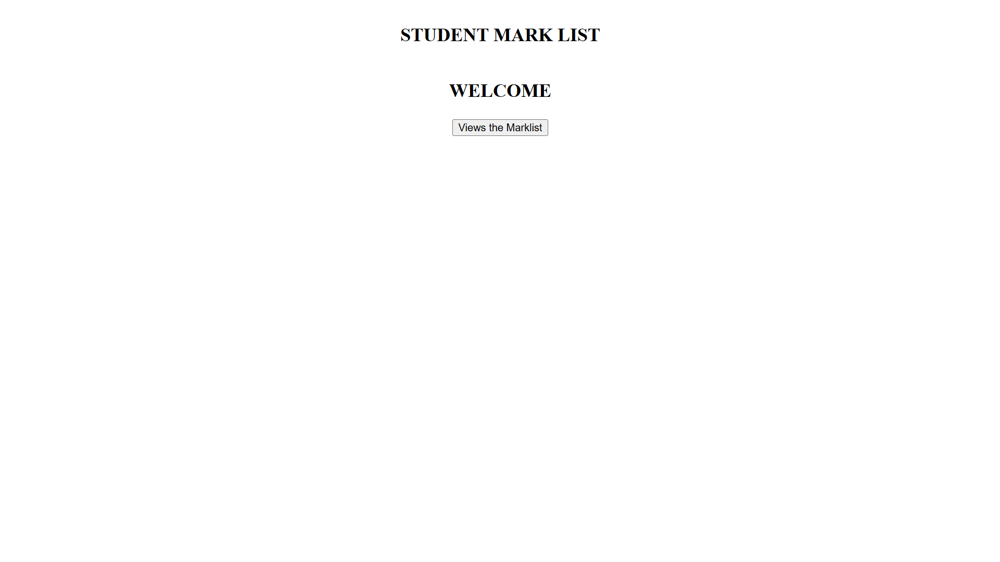 
#
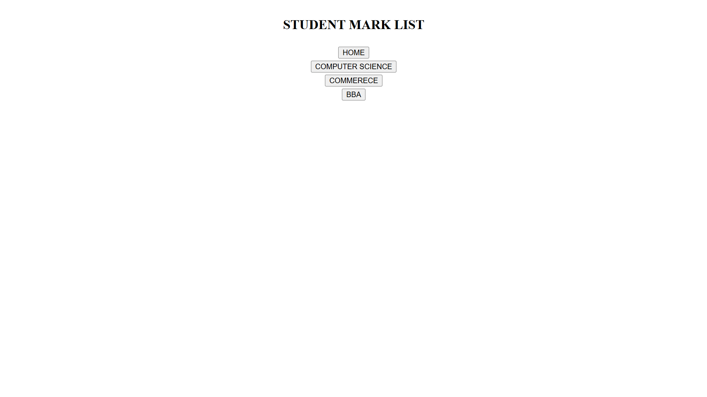 
#
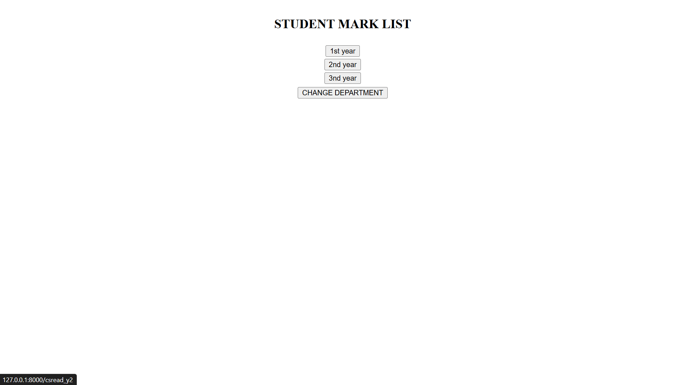 
#
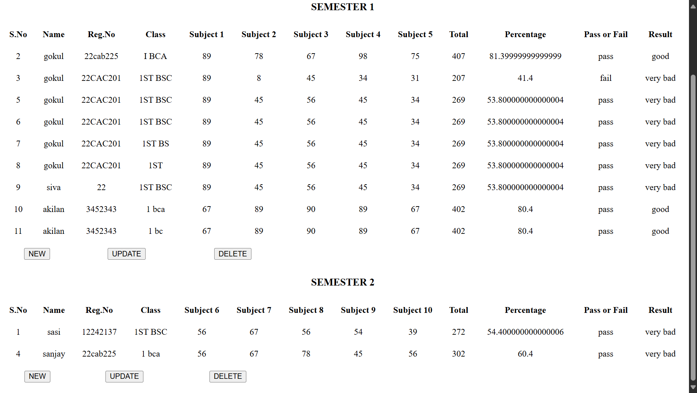 
#
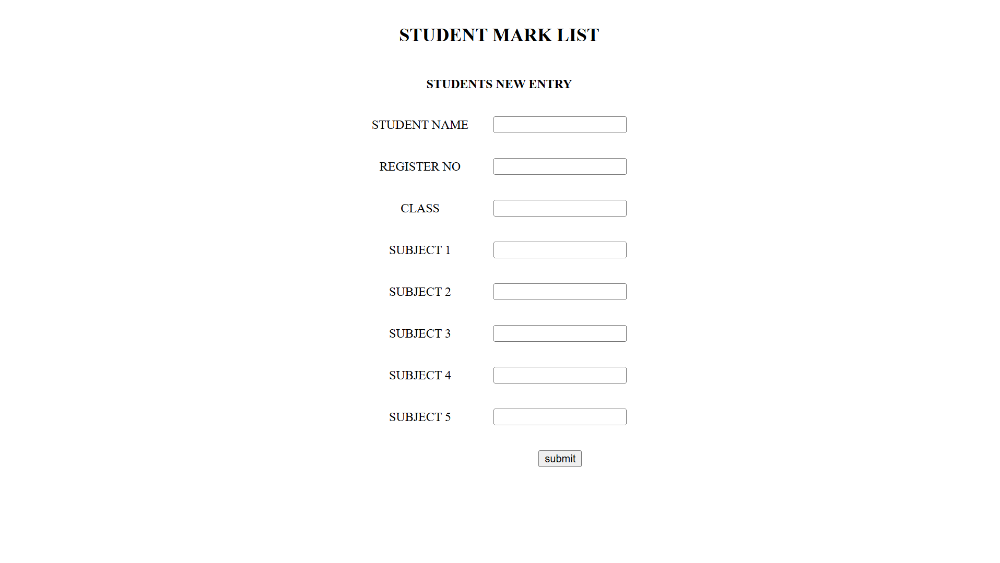 
#
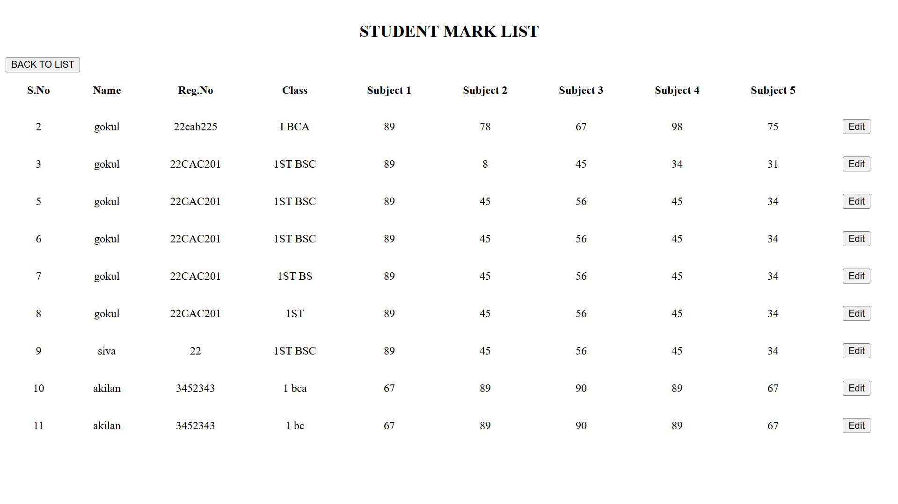 
#
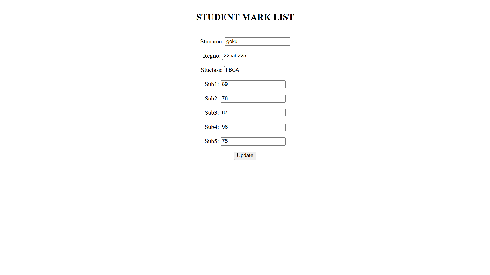 
#
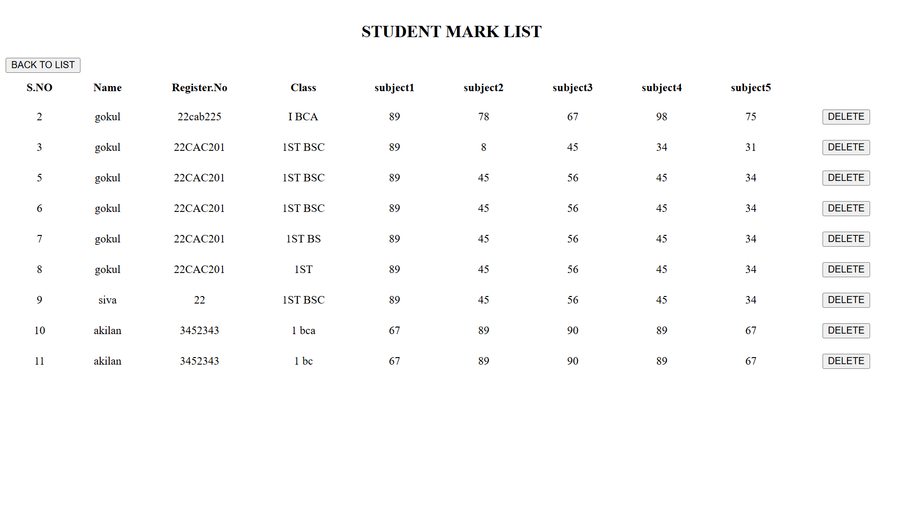 
#
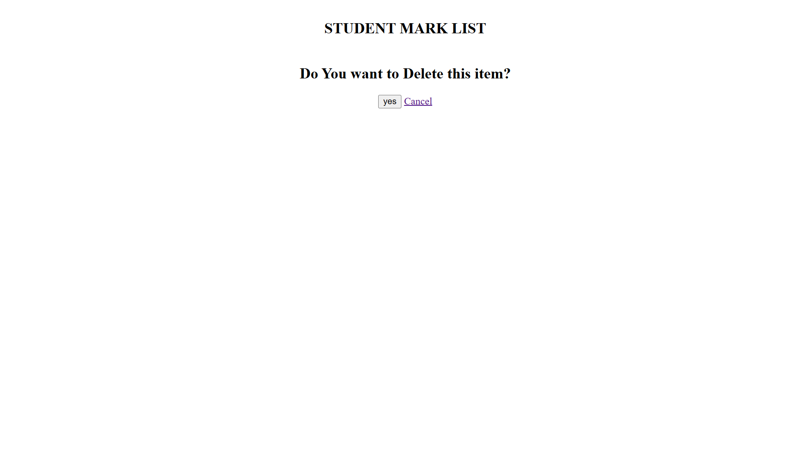 
#
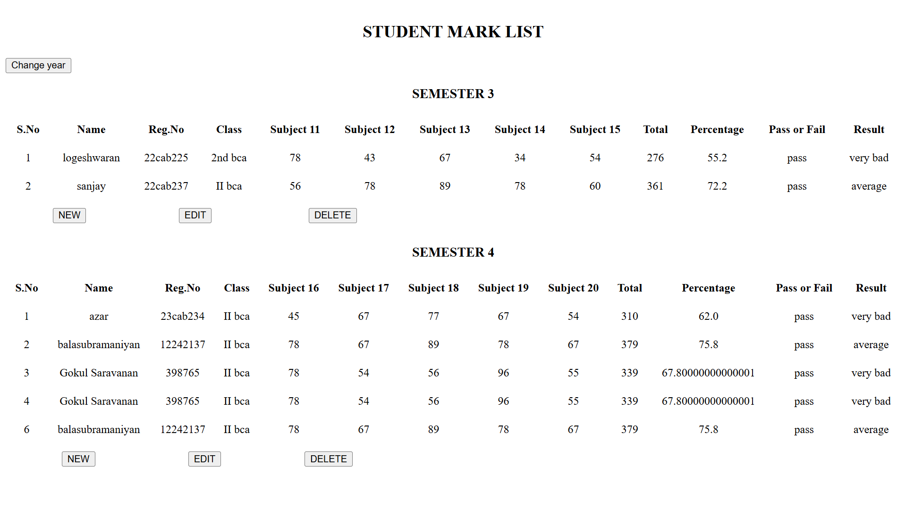 
#
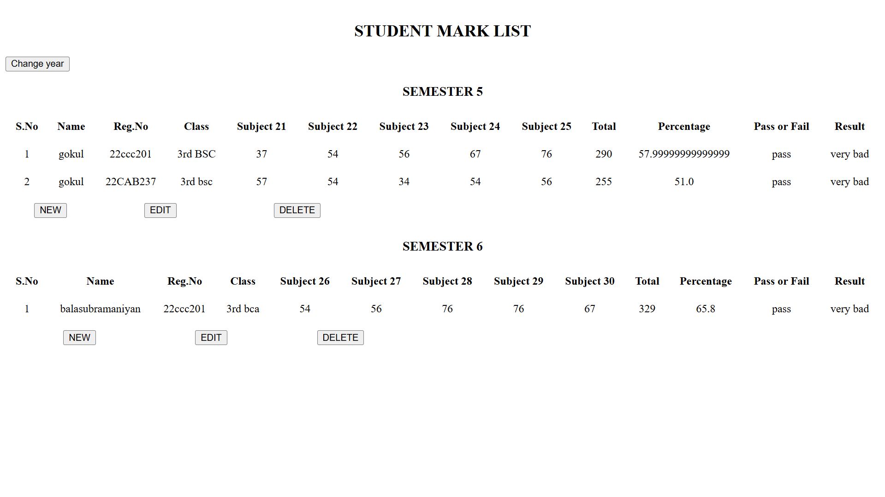 
#